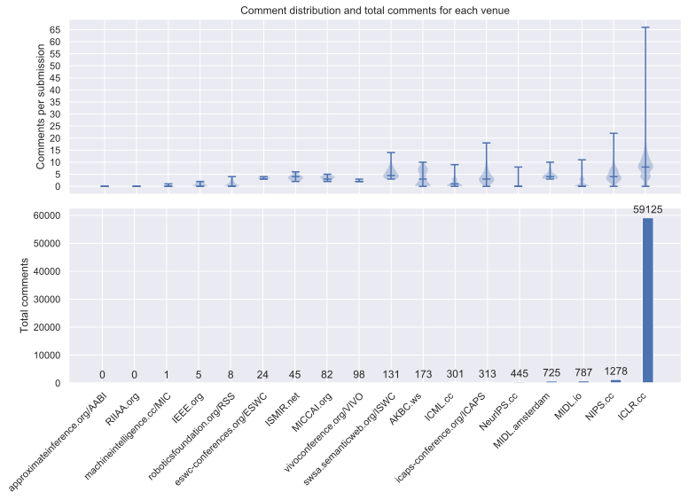
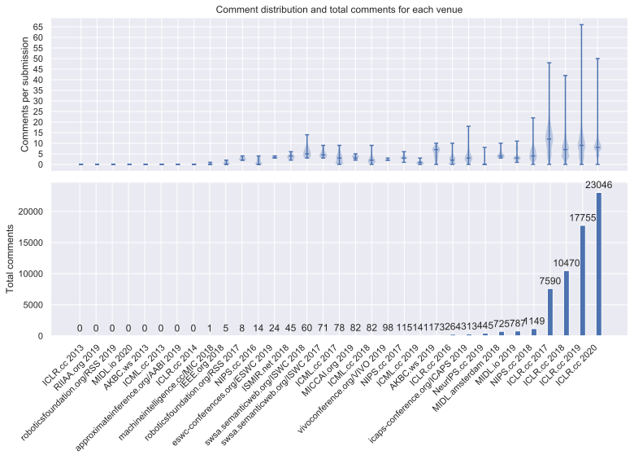

# Statistics of the Data
We consider these questions for our data exploration.

About total numbers:
- How many submissions, comments and paper revisions are there on OpenReview?
- How many submissions are accepted? How many rejected/ withdrawn/ unknown?
- How many comments are reviews? What 'type' do the other comments have?

About class distributions:
- What part of submissions are rejected in each venue? And which venues do not have an acceptance decision at all?
- Which venues have relatively many reviews compared to other comment types?

About the distribution of submissions over the venues:
- Which venue has the most submissions?
- Does a venue get more submission each year?

About comments per submission:
- How many comments does a submission get on average?
- Which venues have the most comments? Which has the most comments per submission? 

About revision per submission:
- How many revisions are uploaded for a submission on average?
- Which venue has the most revisions per submission? 

The data was collected with [config_all.json](../config_all.json) on 03.02.2020. 
Venues with no submissions are ignored.

All values and graphics are created with [statistics_from_json.py](../statistics_from_json.py).

### Total Numbers
|Submissions   |Comments   |Paper Revisions|
|---|---|---|
|9801   |63541 | 18580   |

#### Of the Submissions

|Unknown   |Withdrawn   |Accepted   |Rejected   |
|---|---|---|---|
|2412 |784   |3008   |3597   |

#### Of the Comments

[Definition of types used here:
- Review: 'review' in invitation
- Decision 'decision|acceptance' in invitation
- Plain Comment: 'comment' in invitation
- Other: all other comment notes

These types cover most of the comments. Some notes might be 'misclassified' but we do not really care for this here.]

|Plain Comment|Review|Decision|Other   |
|---          |---   |---     |---|
|35195        |22877 |5022    |447   |

### Distribution of Acceptance Decision and Comment Types in the Venues & Years

We display these distributions as heatmaps for each venue & year.
#### Distribution of Acceptance Decision

#### Distribution of Comment Types

### Distribution of Submissions

#### Distribution over the Venues over all Years

#### Distribution over the Venues & Years

### Distribution of Comments per Submission
#### Distribution over all Submissions
Submissions with 30 or more comments are ignored as outliers.  

#### Distribution within each Venue over all Years
Distributions are displayed with violin plots. Top and bottom line mark the highest/ lowest value and the middle line marks the median.  

#### Distribution within each Venue & Year

### Distribution of Revisions per Submission
#### Distribution over all Submissions
Submissions with 30 or more revisions are ignored as outliers.

#### Distribution within each Venue over all Years

#### Distribution within each Venue & Year

